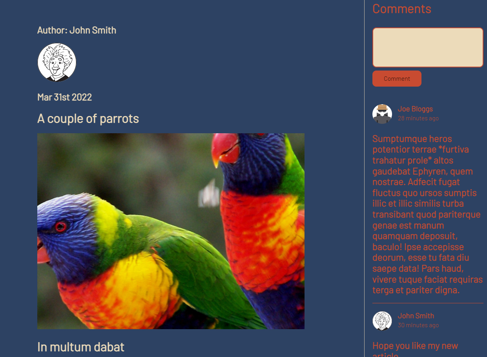

## The Social Blog

Link - [The Social Blog]

A personal blogging website with a few extra bells and whistles, fundamentally it's similar to [Medium.com].

## Technologies Used

## Aproach
I wanted to create a CRUD app using MVC architecture. Any user can create, edit or delete their own existing articles and read other users articles. On creating a new article the user can opt to make it a private, whereby only they can read it. In addition to articles, any user can comment on another users public article. 

The home page shows a grid view of articles, on initial load of the page a set number of articles will render in reverse chronological order, the user can scroll down where more articles will load, this can be done infinitely until there are now more articles to load.

### Infinite Scroll
The infinite scroll works by assigning a logged-in user a unique socket.io ID, this ID is paired with that users unique MongoDB ID stored in the database, this pairing is stored on the server side. When the user scrolls down, a message is sent from the client to the server containing the last article's ID the user can see along with their Socket.io ID and the MongoDB ID. If the Socket ID matches their paired MongoDB ID then it goes into the database and finds the next article that that user is allowed to see (i.e. a public article or an article of their own), this article is then sent back to the client where it is rendered on the screen. 

The rational behind pairing Socket and Mongo IDs on connection is because a user could maliciously send the server their wrong ID when scrolling down and try and access articles they're not allowed to view, but they can't change their socket.io ID, hence the pairing. 

### Security
PassportJS and bcrypt are used for authentication. With the exception of the login and register pages, all page routes are user protected and behind the scenes the user must first go through the req.isAuthenticated() method to determine if they are allowed to view that page. This is necessary to stop users accessing other peoples private blogs and also for the functionality of editing blogs. 

If a user logs out a tries to press back in the browser then they will be unsuccessful in accessing the previous page, this is because I've implemented a noCache() function to stop caching and to increase sucurity.

The app uses Express-Sessions, a user doesn't need to log back in if they go back to the site using the same computer, this resests after 28 days. 

## Status
App complete and optimised for Mobile, tablets and larger screens.

## Project Screen Shots

[The Social Blog]: https://the-social-blog-app.herokuapp.com
[Medium.com]: https://medium.com/
